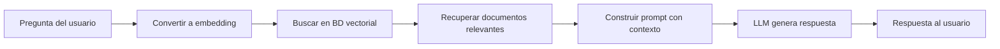

# Flujo típico de RAG

<v-clicks>

### Dos fases principales

1. **Indexación** (una vez): Convertir documentos a embeddings y almacenarlos
2. **Recuperación** (cada consulta): Buscar documentos relevantes y generar respuesta

</v-clicks>
